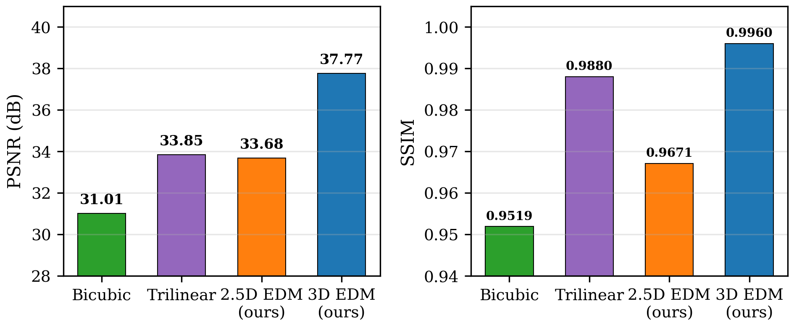
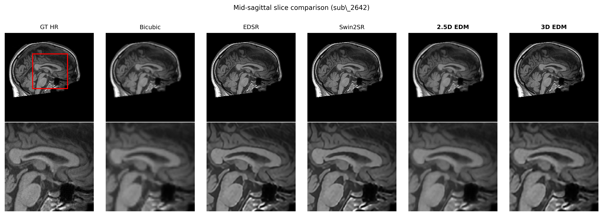
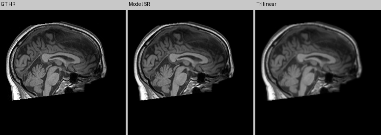
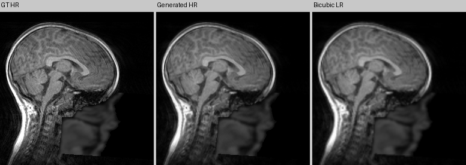
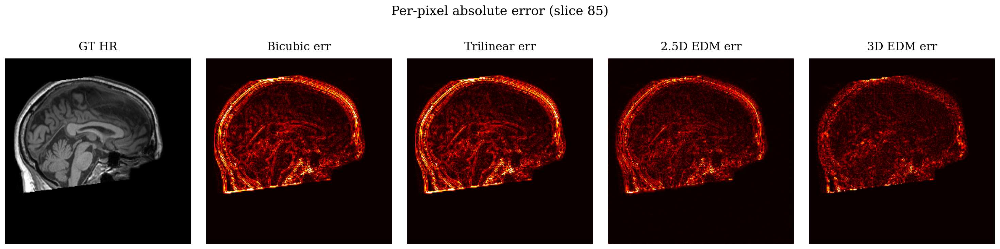
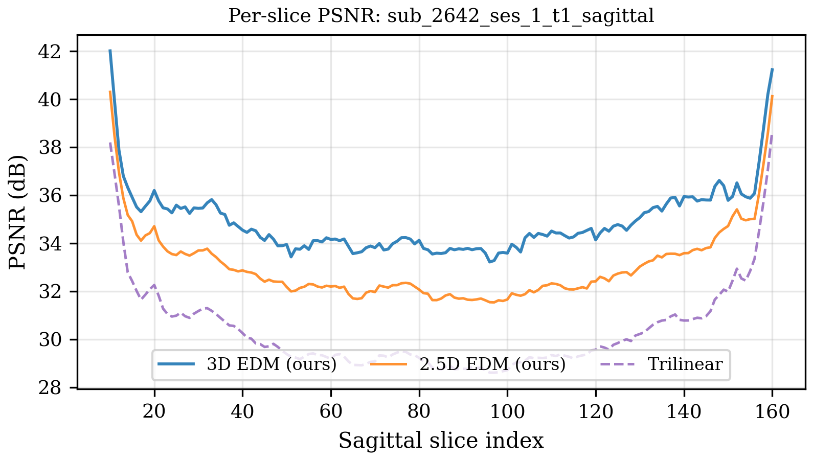

# MRI Super-Resolution via Elucidated Diffusion Models

Comparative analysis of **3D convolutional** and **2.5D slice-conditioned** U-Net architectures for brain MRI super-resolution using the Elucidated Diffusion Model (EDM) framework.

**Pretrained Weights:** [HuggingFace](https://huggingface.co/Chichonnade/Comparative-Analysis-3D-2.5D-MRI-Super-Resolution-EDM)
**Dataset:** [FOMO60K / NKI cohort](https://huggingface.co/datasets/FOMO-MRI/FOMO60K)

## Results

| Method | PSNR (dB) | SSIM | LPIPS | Params |
|---|---|---|---|---|
| Bicubic interpolation | 33.89 | 0.957 | 0.091 | -- |
| EDSR (DIV2K pretrained) | 35.57 | 0.977 | 0.024 | 1.4M |
| Swin2SR (DIV2K pretrained) | 35.50 | 0.978 | 0.024 | 1.0M |
| 2.5D EDM (ours, 10 ep) | 35.82 | 0.971 | 0.040 | 51.1M |
| **3D EDM (ours, 20 ep)** | **37.75** | **0.997** | **0.020** | 50.7M |

Evaluated on 5 held-out NKI subjects (6 volumes, 993 sagittal slices) with 2x SR. All methods evaluated on identical test data and degradation pipeline.



### All Methods Visual Comparison



### Visual Comparison

**3D model** (GT HR | Model SR | Trilinear):



**2.5D model** (GT HR | Generated HR | Bicubic LR):



### Per-Pixel Error Heatmap



### Per-Slice PSNR



## Architecture

Both models use the EDM framework (Karras et al. 2022) adapted from DIAMOND:

- **3D EDM**: Full 3D convolutional U-Net with channels [32, 64, 128, 256], 3D self-attention at the deepest level, patch-based training (32^3) and sliding-window inference with overlap blending. 20-step Euler sampling.
- **2.5D EDM**: 2D U-Net with channels [64, 64, 128, 256], conditions on 1 adjacent slice for inter-slice context. Single-step Heun sampling (0.09s/slice).

## Quick Start

### Install

```bash
pip install -e .
```

### Preprocess data

```bash
python src/raw_data/scripts/main.py src/processed_data_mri src/raw_data/FOMO60K/PT015_NKI \
  --mode 2d --axis sagittal --scale-factor 2
```

### Train 2.5D model (local)

```bash
python src/main.py --config-name trainer_mri \
  common.devices=cpu \
  training.num_final_epochs=10 \
  upsampler.training.batch_size=4 \
  upsampler.training.grad_acc_steps=8
```

### Train on Vertex AI (cloud)

```bash
python scripts/launch_vertex_training.py \
  --preprocessed-data-uri gs://your-bucket/processed_data_mri \
  --project your-project --region us-central1 \
  --service-account your-sa@project.iam.gserviceaccount.com \
  --image-uri your-image-uri \
  --artifact-bucket-uri gs://your-bucket/diamond \
  --epochs 10 --push-latest --yes
```

For 3D training, add `--mode 3d`.

### Run inference

```bash
# 2.5D inference from a cloud run
python scripts/run_inference_from_bucket.py run-YYYYMMDD-HHMMSS --evaluate

# 3D inference (local)
PYTORCH_ENABLE_MPS_FALLBACK=1 python scripts/run_inference_3d.py \
  --checkpoint path/to/model_final.pt --num-samples 6 --num-steps 20
```

### Evaluate

```bash
python scripts/evaluate_25d.py \
  --checkpoint path/to/agent_epoch_00010.pt --num-steps 1
```

## Project Structure

```
config/              Hydra configs (trainer_mri.yaml, agent/mri.yaml, env/mri.yaml)
scripts/             Training launchers, inference, evaluation
src/
  main.py            2.5D training entry point (Hydra)
  train_3d.py        3D training entry point (argparse)
  trainer.py         Core training loop
  models/
    diffusion/       EDM denoiser (2D + 3D variants)
    blocks.py        2D UNet building blocks
    blocks3d.py      3D UNet building blocks
  data/
    dataset.py       2D slice dataset
    dataset_3d.py    3D patch/volume dataset
  metrics.py         PSNR, SSIM, LPIPS implementations
```

## Authors

- **Hendrik Chiche** -- University of California, Berkeley
- **Ludovic Corcos**
- **Logan Rouge** -- ISIMA, Clermont Auvergne INP

In collaboration with GENCI.

## License

This project adapts the [DIAMOND](https://github.com/eloialonso/diamond) codebase for MRI super-resolution.
